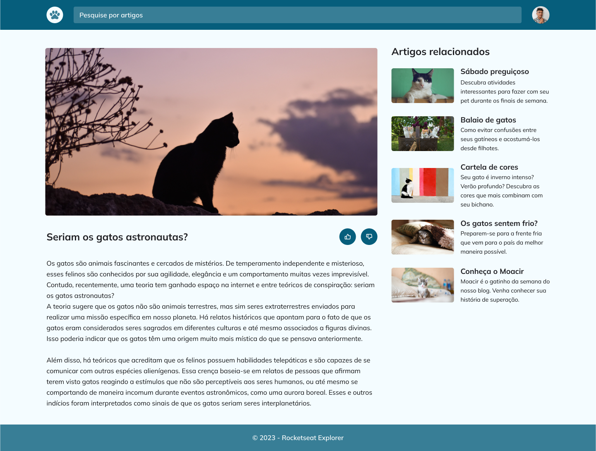

<h1 align="center"> Blog de gatos</h1>

Desenvolvido por Ivan Barbosa. 
Layout UI/UX RocketSeat.

  <a href="#-tecnologias">Tecnologias</a>&nbsp;&nbsp;&nbsp;|&nbsp;&nbsp;&nbsp;
  <a href="#-projeto">Projeto</a>&nbsp;&nbsp;&nbsp;|&nbsp;&nbsp;&nbsp;
  <a href="#-layout">Layout</a>&nbsp;&nbsp;&nbsp;|&nbsp;&nbsp;&nbsp;
  <a href="#memo-licença">Licença</a>

🔖 Pagina

Você pode visualizar e interagir com a pagina do projeto através 

<a href="https://ivanbs14.github.io/Focus_Timer_3.0_Dark_Mode/">Click aqui </a>

  Versão deskotp:
  
  Versão mobile:
  

 

## 🚀 Tecnologias

Esse projeto foi desenvolvido com as seguintes tecnologias:

- HTML
- CSS
- Mobile First
- Git e Github

## 💻 Projeto

Land page de um blog de gatos.

## 🔖 Layout

O layout do projeto foi fornecido por

https://www.rocketseat.com.br/

## :memo: Licença

Esse projeto está sob a licença MIT.

---
